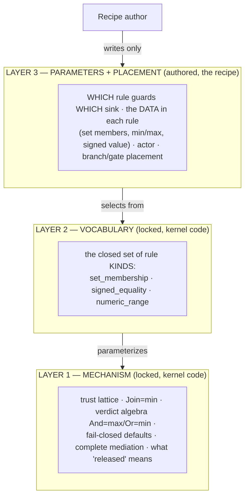
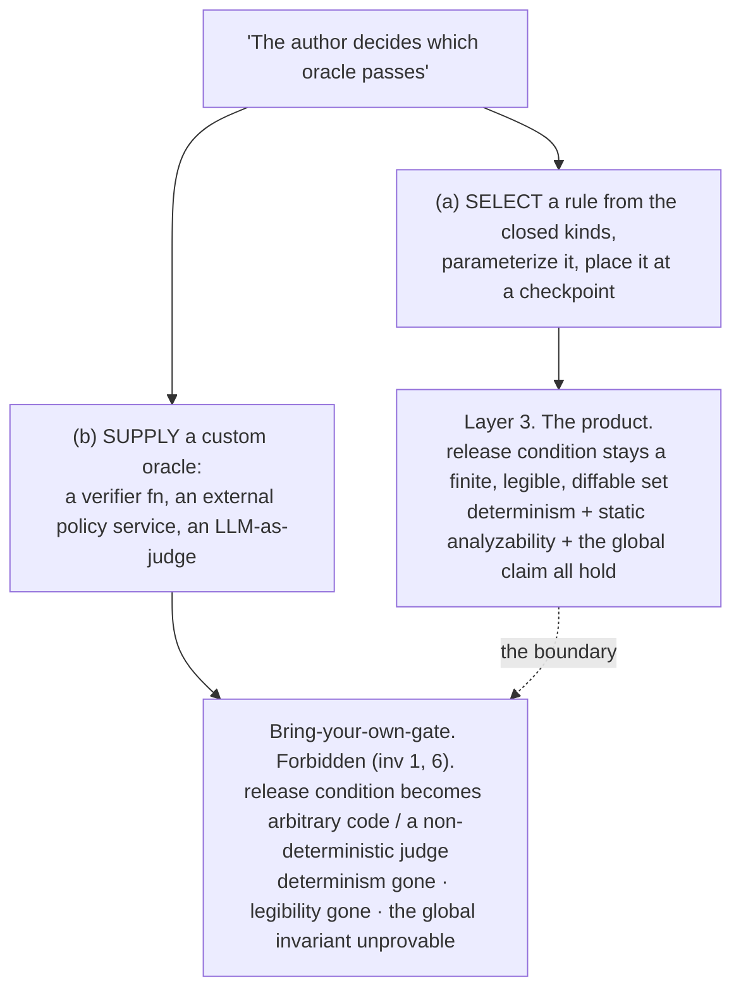
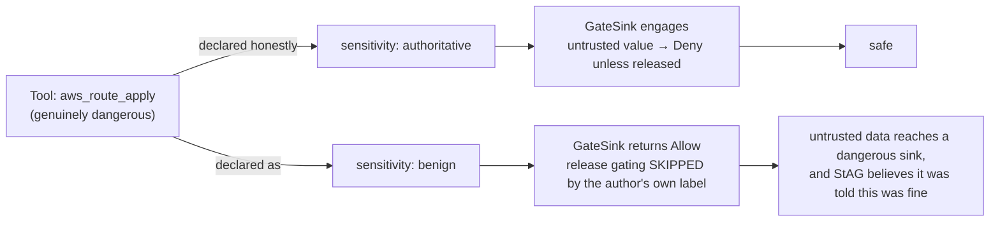

# 10 — The gate configuration boundary

Recorded 2026-07-02. Resolves an apparent contradiction in the governing law and pins the rule that
keeps recipes safe. Invariant 1 says the gate is "never author-configurable," yet authors write
recipes, and a recipe plainly decides which release rule guards which sink. Both are true because
"the gate" is three separable layers, and the author touches only the middle one. This doc draws
the boundary, proves why the authored layer is safe, names the one trap that would break it, and
states the honest ceiling it exposes.

## The three layers of "the gate"



- **Layer 1, the mechanism.** How a verdict is computed from `(subject class, sink sensitivity,
  released)`: the trust lattice (`Untrusted < Caller < Authoritative`, `Join = min`), the verdict
  algebra (`And = max`), the fail-closed defaults, complete mediation (an unregistered sink denies),
  and the structural meaning of "released." This is `internal/gate/sinkgate.go` and
  `internal/trust`. No recipe can reach it.
- **Layer 2, the vocabulary.** The closed set of rule *kinds* in `internal/release`:
  `set_membership`, `signed_equality`, `numeric_range`. An author cannot add `regex_match`,
  `call_service`, or `llm_judge`. Closed by construction (invariant 6).
- **Layer 3, the parameters and placement.** *Which* rule of the closed kinds guards *which* sink,
  the data inside each rule, the actor, and where branches and gate nodes sit. This is the recipe,
  and it is entirely the author's.

**"Which oracle needs to pass" is Layer 3.** An author choosing that `routes.auto_approvable` guards
the route sink is not configuring the gate in the forbidden sense. It is the entire job of a recipe.
Invariant 1 forbids Layers 1 and 2. It was never meant to forbid Layer 3.

### Who owns what

| Layer | Example of the thing | Where it lives | Author can change it? |
| --- | --- | --- | --- |
| 1 Mechanism | `GateSink` returns Deny for unreleased Untrusted→authoritative | `internal/gate`, `internal/trust` | No |
| 1 Mechanism | unregistered / severed sink → Deny | `GateSink` default case | No |
| 2 Vocabulary | the rule kinds are exactly {set, signed, numeric} | `internal/release` `RuleKind` | No |
| 3 Parameters | `set: [class:regional_fallback, class:edge_only]` | recipe `rules:` | Yes |
| 3 Placement | this rule guards this authoritative sink | recipe `steps:` | Yes |
| 3 Placement | a gate checkpoint before this milestone | recipe `steps:` | Yes |

## Why the authored layer is safe

Layer 3 is safe while 1 and 2 are locked because an author's power over a crossing is **monotonic in
the safe direction.** Whatever rule they select and whatever data they load into it, they can only
ever enumerate a specific, finite, legible set of values that may cross. Everything they do not
enumerate still fails closed. No rule at all is a denial, not an opening.

```
Verdict lattice (invariant 8, fail-safe):

      Allow  <  Escalate  <  Deny
     (open)                (closed)

     An authored Layer-3 choice may only ever move a crossing
     ───────────────────────────────────────────────►  toward closed.
     It can NARROW the enumerated set, place a stricter gate, or add a
     checkpoint. There is no Layer-3 lever that moves a verdict toward Allow.
```

Read from the mechanism itself. `GateSink(subject, sink, released)`:

```
sink = benign         → Allow            (not release-gated)
sink = authoritative:
        released       → Allow            (the declassifier cleared this crossing)
        subject == Authoritative → Allow  (already trusted, no crossing)
        otherwise      → Deny             (Caller, Untrusted, severed: inv 8)
default (unregistered) → Deny             (complete mediation, inv 10)
```

`released` is the only door, and it is opened only by a Layer-3 rule matching the value against its
closed enumerable set. The author supplies the set; the author does not supply `Release()`'s logic
or the fact that a non-match denies. So:

- Choosing a rule can make a specific enumerated set releasable. It cannot make anything outside the
  set releasable.
- Choosing no rule leaves the crossing at the fail-closed default (Deny).
- Tightening a set can only remove values from the releasable set, never the mechanism's floor.

This is the same shape as the general rule for any future knob (see "The two rules" below): a
configuration choice may move a verdict toward closed, never toward Allow.

## The trap: select an oracle, never supply one

Two readings of "the author decides which oracle passes" sound identical in English and are
opposites in the architecture.



Path (a) is Layer 3. Path (b) smuggles Layer 2 into the author's hands: the release condition is no
longer a set a human can read before it runs, it is code or a model call. That is precisely what
invariant 6 forbids ("the moment a release rule must judge open-ended content, it is a content
grader in disguise and it fails to laundering") and what invariant 7 means by "legibility, not
soundness."

### This is the StAG / Ratchet divergence, restated

Ratchet's oracle slot is deliberately powerful: the oracle can be a real compiler, arbitrary
verification of an artifact. StAG's crossing oracle is deliberately *not* pluggable arbitrary
verification; it is a selection from a closed set of predicates a human can read. Ratchet can afford
path (b) because its guarantee is per-node and local (the oracle checks each artifact where it
sits). StAG cannot, because its guarantee is global: over every path the recipe graph can take,
nothing crosses to an authoritative sink unreleased and unrecorded. Path (b) makes that global claim
unprovable. So "closed at the gate," "stays statically provable," and "do not become Ratchet"
(Planning/09 discussion) are one constraint seen from three sides.

## The honest ceiling: labels are the integrator's contract

Locking Layers 1 and 2 protects you from a malicious *recipe author*. It does not protect you from a
careless or dishonest *integrator*, because the author configures the gate's *inputs*: the trust
class on each ingredient and the sensitivity label on each sink. The mechanism believes those
labels.



An author who labels a genuinely authoritative sink as `benign` has, by their own declaration, told
the gate not to engage (the first line of `GateSink`). StAG will faithfully pass untrusted data,
because StAG believes the label. This is the **binder-dependency ceiling**, stated plainly per
invariant 12:

> StAG guarantees the mechanism is sound and complete **given the declared labels.** It does not
> guarantee the labels are true.

Consequences that belong in the product's honest scope:

- Declaring sink sensitivity and origin trust honestly is the customer's half of the integration
  contract. The adapter / tool-registration surface (Planning/04) is the actual trust root: mislabel
  there and no downstream gate can recover.
- The author-time linter can catch *structural* self-contradiction (an authoritative sink fed by a
  non-authoritative slot with no rule is the guaranteed-Deny lint, Planning/08 decision 5). It cannot
  catch a *dishonest label*, because a `benign` tag on a dangerous tool is internally consistent. No
  static check knows the tool is dangerous; only the integrator does.
- This is why invariant 12 lists "drop-in tier is ABAC not full IFC" as a named limit. The labels
  are attributes the gate consumes, not facts it verifies.

## The two rules (promoted to invariants 13 and 14)

Both are corollaries the earlier invariants imply but did not state outright; promoted to
`../icm/context/invariants.md` as 13 and 14 on 2026-07-02.

1. **The monotonic-knob rule (invariant 13).** Any author-facing configuration (which rule, its data,
   sink sensitivity, gate placement, an `on_fail:` outcome) may move a verdict toward closed
   (Allow → Escalate → Deny), never toward Allow. Any proposed knob that could move a verdict toward
   Allow is a Layer-1 or Layer-2 change in disguise and is rejected. Corollary of invariants 1 and 8.
2. **The label-honesty contract (invariant 14).** The gate's guarantees are conditional on the
   declared trust classes and sink sensitivities. StAG guarantees soundness *given the labels*; the
   integrator owns their truth. The linter checks structural consistency of labels, never their
   real-world accuracy. Corollary of invariants 1, 10, and 12.

## Cross-references

- Governing law and the twelve invariants: `../icm/context/invariants.md` (esp. 1, 6, 7, 8, 10, 12).
- The declassifier's closed-set argument in depth: `02-declassifier.md`.
- The adapter surface where labels are declared (the trust root): `04-adapter-surface.md`.
- The mechanism this doc dissects: `../harness/workspaces/stag/internal/gate/sinkgate.go`.
- Why global provability forbids Ratchet-grade expressiveness: `09-use-case-and-graph.md` and the
  DEVLOG discussion of 2026-07-02.
